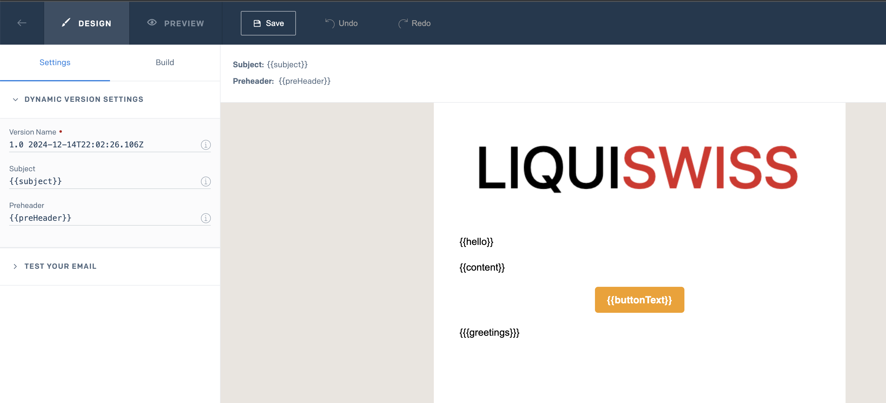

# LiquiSwiss

Liquidity Planning

[Landing Page](https://liquiswiss.ch/)

# Configuration

> We are planning to add [Mailpit](https://mailpit.axllent.org/) for local e-mail testing and replace fixer.io with a
> local mock

1. Copy the [.env.example](.env.example)  into the same directory and name it `.env`
    - Set your credentials for [MariaDB](https://hub.docker.com/_/mariadb)
2. Copy the [backend/.env.example](backend/.env.example) into the same directory and name it `.env`
    - The `WEB_HOST` is set to http://localhost:3000 and works for local dev
    - THE `JWT_KEY` can be anything for local development but make sure to set it for [production](#production)
    - Set your credentials for [MariaDB](https://hub.docker.com/_/mariadb) and make sure they match [.env.example](.env.example)
    - Set your Token for [SendGrid](https://app.sendgrid.com/)
        - This requires you to have an account with SendGrid
            - Create an API key [here](https://app.sendgrid.com/settings/api_keys)
        - You also need to have a [Dynamic Template](https://mc.sendgrid.com/dynamic-templates) and get the ID
            - The template for LiquiSwiss looks like this:
            - 
            - The values to submit can be found in [this model](backend/pkg/models/mail.go)
            - You can find the useage in the [SendgridService](backend/internal/service/sendgrid_service.go)
    - Set your credentials for [Fixer](https://fixer.io/)
        - This requires you to have an account with Fixer
        - Copy the API key that you find in the [Dashboard](https://fixer.io/dashboard)
3. Copy the [fronted/.env.example](frontend/.env.example) into the same directory and name it `.env`
    - The `NUXT_API_HOST` works fine for local dev but must be changed for production

## Production

For production make sure you define the proper values for your envs (no matter in which way you provide them)

- `WEB_HOST` - Reflects your Frontend URL (eg. https://yourdomain.com)
- `JWT_KEY` - Should be a long and secure password
- `NUXT_API_HOST` - Reflects your Backend URL (eg https://api.yourdomain.com)

# Frontend (Nuxt 3)

Look at the [Nuxt 3 documentation](https://nuxt.com/docs/getting-started/introduction) to learn more.

## Setup

```bash
cd frontend
npm install

or

docker compose build (if you have docker)
```

## Development Server

```bash
cd frontend
npm run dev

or

cd frontend
npm run dev-host (to expose host and be able to connect from another device)

or

docker compose up -d (if you have docker)
```

# Backend (Golang)

> Make sure you are in the [backend](backend) directory for all the following actions

## Setup

```bash
go get OR go mod tidy
```

## Development Server

1. Install [Air](https://github.com/cosmtrek/air): `go install github.com/cosmtrek/air@latest`

```bash
air
```

## Migrations

- Create Migration: `goose --dir internal/db/migrations create <name-of-migration> sql`
- Apply Migration: `goose --dir internal/db/migrations mysql liquiswiss:password@/liquiswiss up`
- Rollback Migration: `goose --dir internal/db/migrations mysql liquiswiss:password@/liquiswiss down`
- Or check out the [Makefile](backend/Makefile)

## Tests

> Make sure you are in the [backend](backend) directory

1. Install [Mockgen](https://github.com/uber-go/mock) with `go install go.uber.org/mock/mockgen@latest` to generate
   mocks
    - There are `go generate` commands already in the files so you can simply do `go generate ./...`
1. You can run all tests with `go test ./...`

# Production

Build the application for production:

Every push or merge to master will trigger an automatic deployment via Gitlab Pipeline
